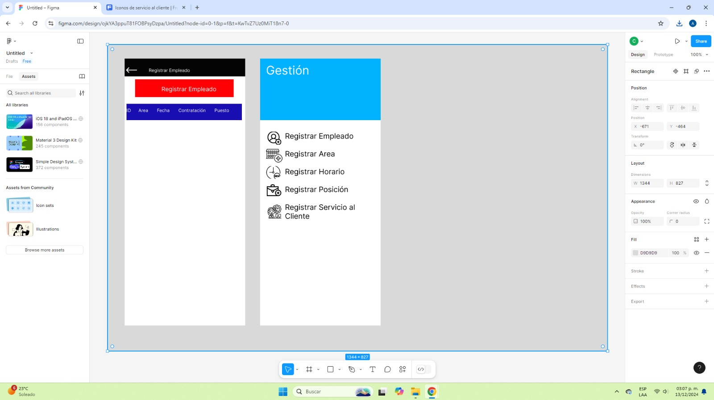
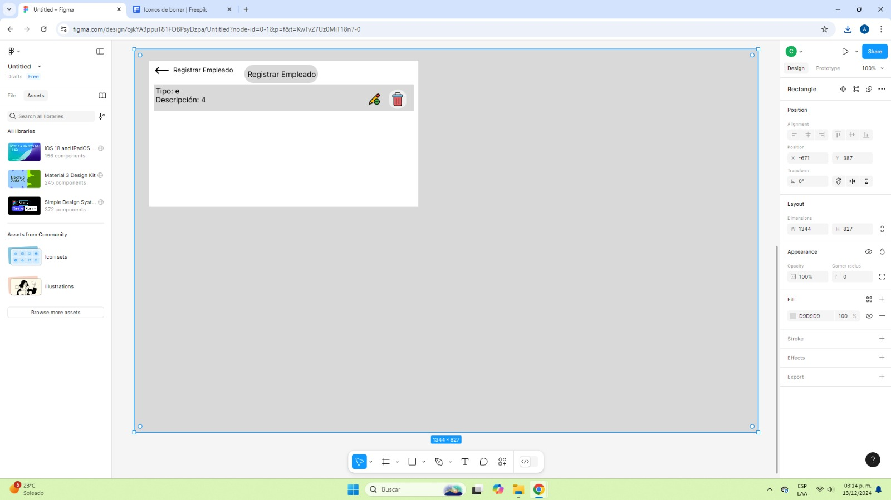
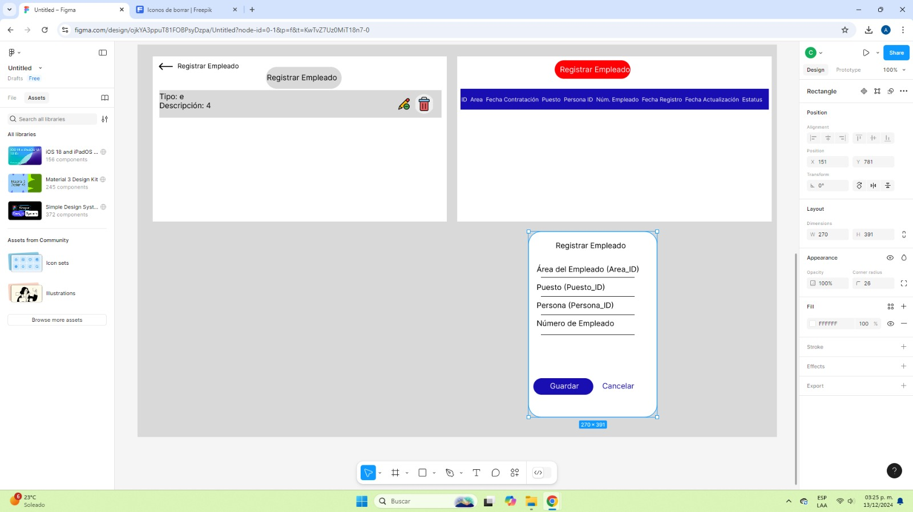
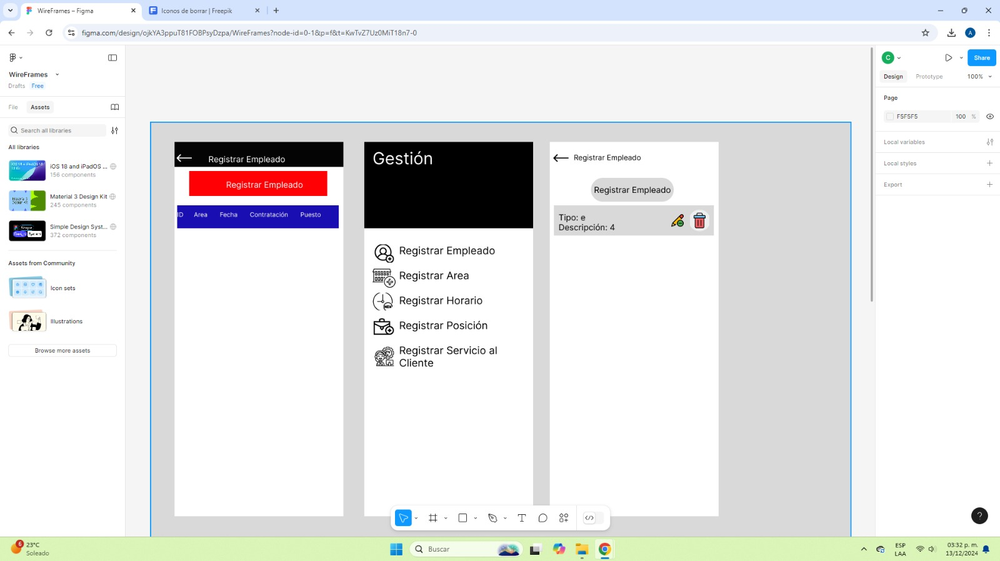
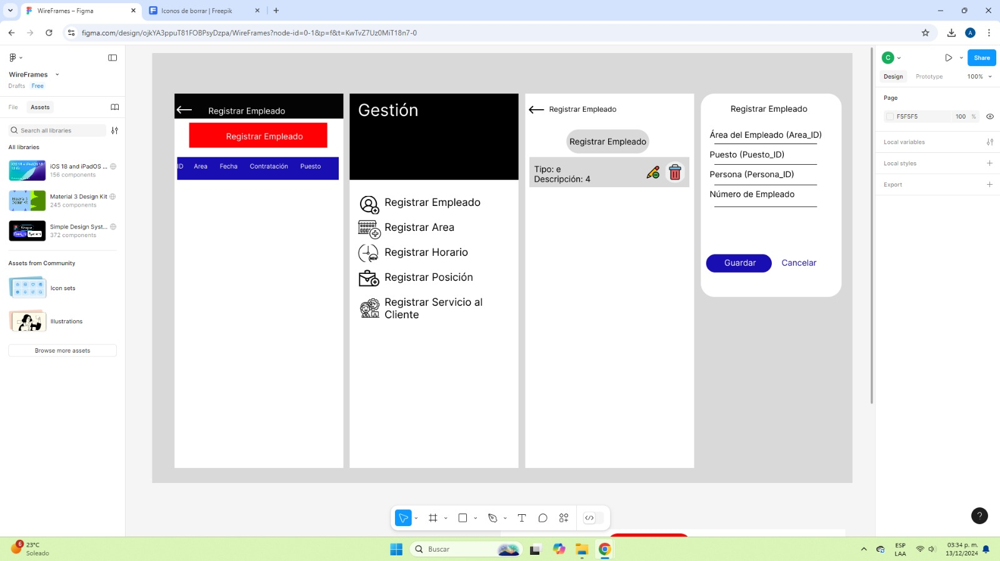

# modulo_rrhh

 
 
<h1 align="center"> Universidad Tecnológica de Xicotepec de Juárez </h1>
 

<h2 align="center"> Modulo  </h2>
<h2 align="center"> Recursos Humanos </h2>

 
<h2> Objetivo </h2>
El objetivo de la interfaz mostrada es proporcionar una plataforma eficiente y organizada para registrar y gestionar la información de los empleados, así como otras funciones relacionadas como áreas, horarios, posiciones y servicios al cliente. Su diseño busca facilitar la navegación y la administración de datos, permitiendo a los usuarios realizar tareas de manera rápida y sencilla dentro de un sistema integral de gestión.
 
<h2 align="center"> Documentación del proyecto </h2>

| Captura | Descripción | 
|:-------------:|:---------------|
|  | La imagen muestra el proceso de creación de una tabla en una base de datos. Se observa el diseño y definición de campos con diferentes tipos de datos, como texto, números y fechas. También incluye elementos visuales que representan claves primarias y foráneas, y cómo estos datos se organizan y validan dentro de la estructura de la tabla.|

| Captura | Descripción | 
|:-------------:|:---------------|
|  |Se observa cómo se definen los campos y sus tipos, organizando la información de manera eficiente para el almacenamiento y acceso.|

| Captura | Descripción | 
|:-------------:|:---------------|
|  |La imagen ilustra cómo se configuran las relaciones entre campos mediante claves, garantizando la integridad y consistencia de los datos.|

| Captura | Descripción | 
|:-------------:|:---------------|
|  |Se representan elementos que aseguran que los datos ingresados cumplen con reglas específicas, como valores únicos y campos obligatorios. |

| Captura | Descripción | 
|:-------------:|:---------------|
|  |La imagen incluye esquemas y tablas interrelacionadas que explican cómo se estructura y organiza la información dentro de una base de datos.|
